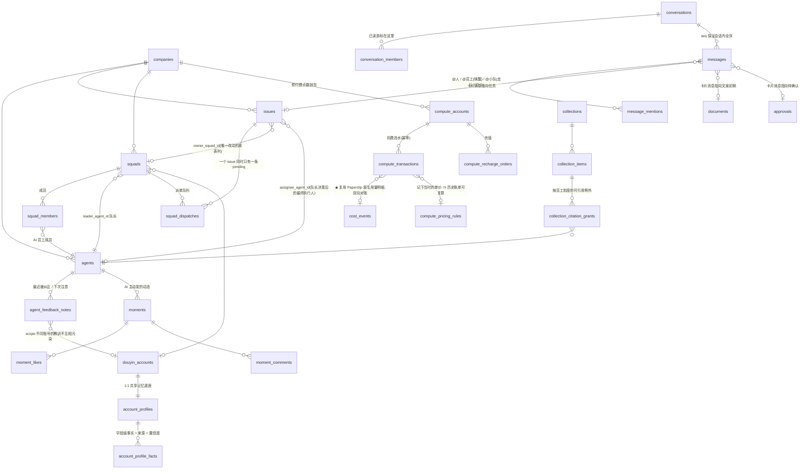

# 协作层数据模型设计文档(JIN-50)

> 底座:fork Paperclip(MIT)。本文档给出「哪些复用、哪些新增、为什么」,并附实测证据。
>
> **落地状态**:drizzle schema + 迁移 `0148_collab_layer.sql` 已写完并跑通(见文末「验证证据」)。
> 因 JIN-49(新仓库)尚未建好,代码暂以 patch 形式交付,仓库就绪后可直接应用。

---

## 0. 先纠正三处任务书里的事实偏差

盘点时对着真实 schema(146 个迁移、125 张表)逐张核了一遍,有三处和任务书描述不符,**都朝着对我们更有利的方向**:

### 0.1 「今日任务」对应的是 `issues`,不是 `cases`

任务书写「今日任务(=issue) → `cases` / `pipelines`」。实际上 Paperclip 里这是**两套独立的东西**:

- **`issues`** —— agent 可执行的任务单元。有 `assignee_agent_id`、`status`、`parent_id`、`execution_run_id`、监控/重试/恢复的一整套执行状态机。**这才是「今日任务」**。
- **`cases` + `pipelines` + `pipeline_stages` + `pipeline_transitions`** —— 通用的「带类型的业务实体 + 看板流转」(`case_type` + `fields` jsonb)。

**结论:两个都要用,但各司其职。**

`cases`/`pipelines` 恰好能表达我们的**内容流水线**:一条视频从「选题 → 文案 → 合规审核 → 发布」的流转,就是一个 `case`(case_type=`content_piece`)走过若干 `pipeline_stages`。而每个阶段派给某个 AI 员工去干的活,是一个 `issue`。Paperclip 甚至已经提供了 `case_issue_links`(role: origin / work / reference)把两者连起来 —— 这正是我们需要的结构,**白捡**。

> 内容流水线的 `case_type` / stage 定义属于业务层,不在本 issue 范围,但数据结构已就位,无需新表。

### 0.2 算力计费:用量明细是**现成的**,缺的只有「余额」

任务书只提到 `budget_policies` / `agents.budget_monthly_cents`。实际上 Paperclip 还有:

| 原生表 | 内容 |
|---|---|
| `cost_events` | `model` / `input_tokens` / **`cached_input_tokens`** / `output_tokens` / `cost_cents` / `agent_id` / `issue_id` / `heartbeat_run_id` |
| `finance_events` | 财务流水(direction / amount_cents / provider / …) |
| `budget_policies` | 限额策略(scope / metric / window / `hard_stop_enabled`) |

**「哪个员工、哪个任务、花了多少 token」这份用量明细,Paperclip 已经有了,直接复用。**
特别是 `cached_input_tokens` 单独成列 —— 和 JIN-51 实测的 prompt caching(命中省 94%)正好对得上,计价时能把缓存命中单独算钱。

**真正缺的是「预付费余额」**:`budget_policies` 是**限额**(这个月最多花 500 元),不是**余额**(你充了 100 元,花完就停)。Paperclip 是后付费的内部工具,没有钱包概念。所以新增的算力模块只做「余额 / 充值 / 扣费流水」,不重造用量明细。

### 0.3 `drizzle-kit generate` 在 upstream 已经不能用了(⚠️ 给 JIN-49)

这条会直接影响工程基建,**请 JIN-49 的同学注意**:

```
meta/ 里的 snapshot:  停在 0099
实际迁移文件:         已到 0147
迁移命名风格:         0000_mature_masked_marvel(drizzle 自动生成)
                     → 0147_cost_event_status(语义命名,人写的)
```

在**未经改动的 pristine upstream** 上跑 `pnpm --filter @paperclipai/db generate`,drizzle-kit 会因为 schema 与 snapshot 漂移而弹出 rename 交互提示(CI 无 TTY 直接报错)。**这是 Paperclip 自己的历史包袱,不是我们引入的。**

**结论:Paperclip 现行约定 = 手写 SQL 迁移 + 手工追加 `meta/_journal.json`,不再生成 snapshot。**
本次 `0148_collab_layer.sql` 就按这个约定写的(并已通过它自带的 `check:migrations` 编号 + 安全校验)。

---

## 1. 复用清单(逐张对着真实 schema 核过)

**能复用的一律不重造。** 125 张原生表里,以下直接用:

| 产品能力 | 复用的 Paperclip 表 | 说明 |
|---|---|---|
| AI 员工 | `agents`(role / title / capabilities / adapter_config / permissions / budget)+ `agent_config_revisions` | 配置版本化现成 |
| 员工运行态 | `agent_runtime_state` / `agent_task_sessions` / `agent_wakeup_requests` / `heartbeat_runs` | 执行层直接挂 |
| 多真人协作 | `user` / `session` / `account`(better-auth)+ `companies` / `company_memberships` / `project_memberships` / `principal_permission_grants` | 多租户 + 权限齐了 |
| 今日任务 | **`issues`** + `issue_comments` / `issue_relations` / `issue_labels` / `issue_read_states` | 见 §0.1 |
| 内容流水线 | `cases` / `pipelines` / `pipeline_stages` / `pipeline_transitions` / `case_issue_links` | 见 §0.1 |
| 文案待确认 | `approvals`(type / payload / status / decided_by)+ `approval_comments` / `issue_approvals` | 通用审批,够用 |
| 文案/文档 | `documents` + `document_revisions`(+ 批注三件套) | 文案初稿 = document,自带版本 |
| 方法包(skills) | `company_skills` + `_versions` / `_stars` / `_comments` / `_test_runs` | 完整的技能市场,含测试运行 |
| 招聘 / 团队模板 | `packages/teams-catalog`(**代码包,不是表**)+ `agents` + `agent_memberships` | 「入职」= 建 agents 行 + agent_memberships |
| 算力用量明细 | `cost_events` / `finance_events` / `budget_policies` | 见 §0.2 |
| 工作记录 | `activity_log` | actor_type / action / entity / details |
| 附件 | `assets` | |

---

## 2. 新增清单:21 张新表 + 1 个可空列

**纯加法。** 对 Paperclip 原有代码的改动一共 **24 行,0 删除**(`issues.ts` +10 / `index.ts` +14),
唯一碰到原表的地方是 `issues` 上加一个可空列 `owner_squad_id`(无默认值 ⇒ 不重写表、无锁风险)。

| 模块 | 新增表 |
|---|---|
| A. 小队 + 队长路由 | `squads` / `squad_members` / `squad_dispatches` **+ `issues.owner_squad_id`** |
| B. 抖音账号 + 账号档案 | `douyin_accounts` / `account_profiles` / `account_profile_facts` |
| C. IM 消息 | `conversations` / `conversation_members` / `messages` / `message_mentions` |
| D. 收藏(知识库) | `collections` / `collection_items` / `collection_citation_grants` |
| E. Agent 反馈学习 | `agent_feedback_notes` |
| F. 朋友圈 | `moments` / `moment_likes` / `moment_comments` |
| G. 算力账户 | `compute_accounts` / `compute_pricing_rules` / `compute_transactions` / `compute_recharge_orders` |

### 通用约定(与 Paperclip 保持一致)

- 每张表以 `company_id` 为租户锚点,复合索引一律 `company_id` 前置
- **domain 表不外键到 `user` 表**(`user_id` 是裸 `text`)—— 这是 Paperclip 的既有约定:全库只有 `account`/`session`/`board_api_keys`/`cli_auth_challenges` 4 张 auth 表外键到 `user`。跟随它,将来换 auth 方案不会牵连业务表
- 「参与者可能是真人也可能是 AI」的地方,一律 `xxx_type` + `xxx_user_id`(text) + `xxx_agent_id`(uuid),并加 **XOR CHECK 约束**兜底
- 软删除用 `deleted_at`,热查询走 `WHERE deleted_at IS NULL` 的部分索引

---

## 3. ER 图



---

## 4. 关键设计决策(验收明确要求写清理由的三项 + 其余)

### 4.1 小队路由:为什么是「一个可空列 + 一张派单表」,而不是只改一个字段

**产品诉求**:任务派给小队 → 队长(账号主理人)决定分给谁。

Paperclip 只有 `agents.reports_to`(单一上级链),表达不了「一个小队 + 一个队长 + 一组成员」。方案三选一:

| 方案 | 问题 |
|---|---|
| ① 只把 squad_id 塞进 `issues.execution_policy` jsonb | 无外键、无法建有效索引、无完整性约束。任务列表是最热的查询,不能建在 jsonb 上 |
| ② 纯旁路表 `issue_squad_assignments`(0 改原表) | 「今日任务」列表每次都要多一次 JOIN;且「当前归属小队」需要靠部分唯一索引模拟,反而更绕 |
| ③ **`issues.owner_squad_id` 可空列 + `squad_dispatches` 派单表** ✅ | 选它 |

**选 ③ 的理由**:

1. **可空列是对原表侵入性最小的改法** —— 无默认值 ⇒ PostgreSQL 不重写表、不长时间持锁;upstream 合并时它只是 drizzle schema 文件里多出的一行,冲突面极小。为了省这一行而让最热的查询多背一个 JOIN,不划算。
2. **`owner_squad_id` 和 `squad_dispatches` 表达的是两件不同的事,不能合并**:
   - `owner_squad_id` = **当前状态**(这活归哪个小队)—— 查询用
   - `squad_dispatches` = **决策过程**(谁在什么时候把活派给了谁、为什么、改派过几次)—— 审计与队长的待办队列用

   `issues.assignee_agent_id` 只有最终结果,**没有过程**。而「队长为什么把这活派给文案编导而不是选题策划师」恰恰是这个产品要向用户展示的核心价值,必须留痕。

3. **两个约束由 DB 兜底**(已实测):
   - `squad_members_single_leader_uq` —— 一个小队最多一个队长(部分唯一索引 `WHERE role='leader'`)
   - `squad_dispatches_issue_pending_uq` —— **一个 issue 同时只能有一条 pending 派单**(部分唯一索引 `WHERE state='pending'`)。这条防的是并发/重试导致的重复派单;闭环(dispatched)之后可以再次派单,改派场景不会被误锁。

**派单流转**:
```
用户在群里说「这周要 3 条视频」
  → 建 issue,owner_squad_id = 小队,插一条 squad_dispatches(state=pending)
  → 队长 agent 拉 pending 队列(走部分索引,实测 0.16ms)
  → 队长决策:assigned_agent_id=文案编导,decision_reason='文案类任务',state=dispatched
  → 回写 issues.assignee_agent_id → 执行层照常跑
```

### 4.2 账号档案:为什么是「头表 + 字段级事实表」,而不是一张宽表

**产品诉求**:账号档案是全体 AI 员工的**共享记忆底座**(定位 / 目标客户 / 表达偏好 / 禁用表达 / 有效方法 / 完整度% / 缺失项),数据来自 **TikHub 同步 + 简历 + 历史文案 + 用户手填**。

**四个来源必然冲突。** 一张宽表只能存「最后写入的那个值」—— 谁覆盖了谁、凭什么覆盖,全部丢失。于是:

- **`account_profiles`(头表,1:1 于账号)** —— 存 `curated_snapshot`:**agent 注入 prompt 时读的就是这一份**,一次读取拿到全部档案,不必扫事实表再自己聚合。同时存 `completeness_pct` / `missing_fields` 供 UI 直接显示。
- **`account_profile_facts`(字段级)** —— 每条事实带 `source` / `source_priority` / `confidence` / `evidence_ref`。

**这样三件事才成立**:

1. **完整度% 可计算**,而不是人肉估:`已填字段数 / 规格要求字段数`(规格 `PROFILE_FIELD_SPEC` 放代码里,用 `spec_version` 挂钩)
2. **缺失项直接得出** = 规格字段 − 已有字段 → 直接驱动「档案管家下一步该去补哪一项」
3. **冲突消解有确定规则**:`source_priority` 约定 `user=100 > resume=80 > tikhub=60 > history_content=40 > agent_inference=10`。**用户手填稳定压过模型推断**,且 `evidence_ref` 留下证据链(这条结论是从哪条视频/哪段对话推出来的)。

**`account_profile_facts_active_field_uq`**(部分唯一索引 `WHERE status='active'`)保证**每个字段同一时刻只有一条生效事实** —— 冲突必须被显式消解(旧的置 `superseded`),不能靠「谁最后写谁赢」。已实测:模型先推断出「劳动法维权科普」,用户手填「劳动纠纷实务」后,active 事实确定为用户那条。

> **与 `agent_feedback_notes` 的分工**(很容易混):
> **账号档案** = 关于**账号**的事实,**全体员工共享**;
> **反馈笔记** = 关于**某个员工怎么干活**的教训,**员工私有**。
> 「这个账号不许说『家人们』」是账号事实;「你上次标题写得太标题党」是员工教训。

### 4.3 引用权限:为什么是「默认开关 + 例外行」,而不是全量授权表

**产品诉求**:收藏条目要能**按 AI 员工粒度**控制「可被引用」(明确点名:选题策划师 ✅ / 账号诊断师 ❌)。

- ❌ **全量授权表**(每个 item × 每个 agent 一行):M×N 行。新招一个员工要回填全部历史条目,新加一条收藏要回填全部员工 —— **必然漂移**,总有几行忘了写。
- ✅ **`collection_items.default_citable`(默认开)+ `collection_citation_grants`(只存例外)**:

  ```sql
  allowed = COALESCE(grant.allowed, item.default_citable)
  ```

  授权表**始终很小** —— 产品里「账号诊断师不可引用」就只是一行。新员工自动继承默认值,不需要任何回填。

已实测:同一条目,文案编导(无例外行)→ 可引用;账号诊断师(例外行 allowed=false)→ 不可引用。

### 4.4 IM:消息顺序靠 `seq`,不靠 `created_at`

群聊里消息顺序错乱是致命体验问题,**必须由 DB 给出确定性全序**:

- `conversations.last_seq` 是序号分配源。**消息插入与 `last_seq` 自增在同一事务内完成** ⇒ 每会话「全序 + 无空洞」。
- `messages_conversation_seq_uq`(唯一索引)兜底,同时充当 **keyset 分页游标**。

**为什么不用 `created_at` 排序**:同毫秒并发写入会并列,多实例间时钟漂移会乱序。WebSocket 推送顺序与客户端补洞(发现 seq 跳号即知丢包)都依赖这个单调序号。

**已读:用游标,不用回执。**
`conversation_members.last_read_seq` ⇒ `未读数 = conversations.last_seq − last_read_seq`,**O(1) 得出,永不扫 messages**。
微信式群聊只需要「未读数」,不需要每条消息的已读回执 —— 后者要 N×M 行,且产品里没有任何界面消费它。真要做「已读 12 人」再补 `message_read_receipts` 表。

**卡片消息:快照 + 外键并存,是刻意的。**
`card_payload`(jsonb 渲染快照)+ `issue_id`/`document_id`/`approval_id`(外键):
- 快照让消息流「历史即所见」—— 文案后来被改了,不会**回溯篡改聊天记录**里当时那张卡片
- 外键让「点击卡片 → 跳到真实实体去操作」成立

### 4.5 算力:余额非负与扣费幂等,都由 DB 兜底

- **单位约定:1 点 = 1 分(人民币)。** 于是 `cost_events.cost_cents` 与 points **天然 1:1,对账无需换算**。
  **1M token = 5 元 = 500 点**,写在 `compute_pricing_rules` 里(配置项,不是硬编码)。
- **定价按 `effective_from` 版本化,不是一行可变的 settings。** 理由:改价那一刻,所有历史账单的重算结果都会跟着变,**对账即失效**。单价必须是「事件发生时点」的快照 —— 扣费时把 `pricing_rule_id` 记进流水,任何一笔历史消费都能原样复算。
- **三档分列**(`points_per_1m_input` / `_cached_input` / `_output`):现在默认同价(= 1M token 5 元),但列先留好。JIN-51 实测 prompt caching 命中省 94% input,**将来对缓存命中单独降价无需改表**。
- **`compute_accounts_balance_check` CHECK (balance_points >= 0)** —— 余额不可为负由 **DB 兜底**,不依赖「应用层记得先查再扣」(那是竞态的温床)。配 `version` 列做乐观锁防并发丢失更新。
- **`compute_transactions_idempotency_uq`** —— run 失败重试会重放扣费,**没有幂等键就是重复扣钱,真金白银的 bug**。键形如 `run:<runId>:cost:<costEventId>`。另有 `compute_transactions_cost_event_uq` 保证一条 `cost_event` 最多扣一次费。
- **支付回调会重复投递** ⇒ `compute_recharge_orders_channel_external_uq`(外部订单号唯一),回调重放不会重复加点。

---

## 5. 验证证据(不是「设计完了」,是「跑起来了」)

在 PostgreSQL 16 上,**全新库端到端重放 Paperclip 全部 146 个迁移 + 我们的 `0148`**:

| 检查项 | 结果 |
|---|---|
| 迁移端到端重放(146 + 0148) | ✅ 147 个全部应用成功,共 146 张表(原 125 + 新 21) |
| Paperclip 自带 `check:migrations`(编号 + 迁移安全) | ✅ 通过 |
| `tsc --noEmit` 类型检查(against 真实 Paperclip schema) | ✅ exit 0 |
| Paperclip `packages/db` 既有单测 | ✅ **11 files / 75 tests 全绿**(未打破任何既有测试) |
| 不变量断言 | ✅ **14/14 通过**(见下) |
| 对原有代码改动量 | **+24 行,0 删除**(`issues.ts` +10 / `index.ts` +14) |

**14 组不变量断言**(每条都真的去违反了一次,确认被 DB 拒绝):
单队长唯一 / 成员身份 XOR / 单 issue 单 pending 派单 / 闭环后可改派 / 会话内 seq 唯一 / 卡片必须带 card_type / 每字段单条 active 事实 / 用户手填覆盖模型推断 / 按员工粒度可引用开关 / **余额不可被扣成负数** / **扣费幂等键拦住重复扣费** / 重试后余额未被二次扣减 / 默认定价 500 点/1M / 朋友圈作者 XOR。

### 查询计划(`EXPLAIN ANALYZE`,20 万条消息 + 5 万条笔记的真实数据量)

| 热路径 | 计划 | 耗时 |
|---|---|---|
| 打开会话首屏(最近 50 条) | `Index Scan Backward` on `messages_conversation_seq_uq`,**5 buffers** | **0.20ms** |
| 消息向上翻页(keyset) | `Index Scan Backward` | **0.22ms** |
| 队长拉 pending 派单队列 | `Index Scan` on 部分索引 | **0.16ms** |
| Agent 长期记忆注入(top-20) | `Index Scan`,读满 20 行即停 | **0.30ms** |

**其中第 4 条是被实测揪出来并改掉的一个真 bug:**

最初我把索引建成 `(agent_id, douyin_account_id, weight DESC, created_at DESC)`。看着合理,实际**跑出了 Seq Scan,扫了 45,000 行、15.9ms**。

根因:注入查询真实形态是
```sql
WHERE agent_id = ? AND status='active'
  AND (douyin_account_id IS NULL OR douyin_account_id = ?)   -- 全局教训 + 本账号教训
ORDER BY weight DESC, created_at DESC LIMIT 20
```
这个 **OR 让 scope 列没法充当有序索引前缀** —— planner 只能走 bitmap scan,而 **bitmap scan 不保序**,于是退化成「全量取回 45k 行 + top-N sort」。

改成 `(agent_id, weight DESC, created_at DESC) WHERE status='active'`,把 scope 降级为 filter 回查:
**15.9ms → 0.30ms,约 45 倍**;扫描行数 45,000 → 20(读满即停)。同一 agent 的笔记绝大多数在 scope 内,提前终止几乎立即命中。

> 这也是为什么每条查询上线前都得先跑 `EXPLAIN ANALYZE` —— 「看起来该走索引」和「真的走了索引」是两回事。

---

## 6. 给相邻任务的接口契约

- **JIN-49(工程基建)**:⚠️ 见 §0.3,`drizzle-kit generate` 在 upstream 已坏(snapshot 停在 0099),**别把它写进 CI**。现行约定是手写 SQL + 追加 journal。
- **TikHub 同步任务**:`douyin_accounts` 是账号身份锚点,已就位(含 `sec_uid` 唯一约束、`tikhub_synced_at` 同步调度索引)。**视频维度的 `douyin_videos` / `douyin_video_metrics`(时序)由该任务定义并外键到 `douyin_accounts.id`**,本 issue 不预先占坑,避免两边重复定义。
- **JIN-51(模型网关 + 计费)**:扣费只需做两件事 —— ① 读 `compute_pricing_rules` 拿到当时单价;② 按 `cost_events` 一条一扣,幂等键用 `run:<runId>:cost:<costEventId>`。余额非负与重复扣费,DB 已经拦住了。
- **执行层**:`message_mentions.wakeup_state` 是 @员工 → 唤醒 agent 的队列(`agent_pending_idx` 部分索引);`@小队` 不直接唤醒 agent,而是走 `squad_dispatches` 队长路由。

## 7. 已知待办(不阻塞本次交付)

1. **`messages` 会成为全库最大的表。** 建议把它加进 Paperclip 的 `table-size-estimates.ts`,这样它自带的迁移安全检查会**强制后续在 `messages` 上建索引必须用 `CONCURRENTLY`**。(当前 `issues` 属 medium 档,所以本次那个新增的部分索引用普通 `CREATE INDEX` 是被允许的;且我们是全新库,建表时零行,无锁风险。)
2. `moments.like_count` / `comment_count` 是冗余计数器(信息流每条都要显示,现算是 N+1 的经典来源),需要在点赞/评论的写路径里同事务维护。
3. 内容流水线的 `case_type` / `pipeline_stages` 具体定义,待产品确认后配置化落地(**无需新表**)。
